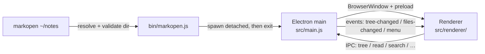

# Architecture

markopen is a small Electron app: no bundler and no framework, about 2,000 lines of our own code (JS, HTML, CSS).

## Launch flow



1. `bin/markopen.js` resolves the argument (default `.`) and exits with an error if it isn't a directory. It then runs `build/markopen.app/Contents/MacOS/Electron <appDir> <dir>` as a detached child and exits, so the terminal is free immediately. If the bundle is missing, it tells you to run `npm install`.
2. `src/main.js` treats the last command-line argument as the root directory. It registers the IPC handlers and the `markopen:` protocol, installs the app menu, and opens one window titled `markopen — <dir name>`. Closing the window quits the process.
3. The renderer asks main for the tree, draws the explorer, and asks for file contents when you click a file.

## App bundle (`scripts/make-app.js`)

macOS takes the menu-bar name, Dock name and icon from the running bundle's `Info.plist`, not from anything the app can set at runtime. So `postinstall` copies `node_modules/electron/dist/Electron.app` to `build/markopen.app`. It then sets `CFBundleName`/`CFBundleDisplayName` to `markopen` and `CFBundleIdentifier` to `com.adamstahl.markopen`, and overwrites `Resources/electron.icns` with `assets/icon.icns`. The executable and helper apps keep their "Electron" names so Electron can still find its helpers. No re-signing is needed: the binary's linker ad-hoc signature doesn't bind `Info.plist` (`codesign -dv` shows `Info.plist=not bound`).

The bundle holds no app code; it's passed the project folder as its app path. That's why the `../../node_modules/...` script paths still work and edits show up on the next launch.

`assets/icon.icns` is generated from `assets/icon.svg` by `scripts/make-icon.js`. That script renders the SVG in an offscreen Electron window, resizes it into an `.iconset`, and runs `iconutil`.

## Processes and the IPC surface

The page runs with `contextIsolation: true`, `sandbox: true` and `nodeIntegration: false`, so it has no Node or filesystem access of its own. `src/preload.js` exposes these request calls as `window.markopen`:

| Call | Main-process handler | Returns |
|---|---|---|
| `getTree()` | `buildTree(root)` | `{ rootName, tree }` |
| `readFile(rel)` | `fs.readFileSync` / `fs.statSync` of `resolveInsideRoot(root, rel)` | `{ text, mtime }` |
| `setTheme('light' \| 'dark')` | `nativeTheme.themeSource = …` | nothing |
| `search(query)` | `searchFiles(root, flattenFiles(buildTree(root)), query)` | `[{ path, matches: [{ line, text }] }]`, at most 200 lines |
| `findByName(name)` | `findByName(root, name)`: breadth-first, any file type, same skip rules as the tree | root-relative path or `null` |
| `openInEditor(rel)` | `open -a "Visual Studio Code" <abs>` | nothing |
| `reveal(rel)` | `shell.showItemInFolder(abs)` | nothing |

Main also pushes three events, which the page subscribes to through `onTreeChanged(cb)`, `onFilesChanged(cb)` and `onMenu(cb)`:

| Event | Payload | Sent when |
|---|---|---|
| `tree-changed` | the new tree | the rebuilt tree differs from the last one sent |
| `files-changed` | changed markdown paths, or `null` if unknown | after every batch of disk changes |
| `menu` | an action name (`find`, `quick-open`, `back`, `zoom-in`, …) | a menu item or its shortcut is used |

`resolveInsideRoot` (in `src/tree.js`) rejects any path that resolves outside the opened directory. Every call that takes a path goes through it, so even a compromised page can only read files under the root.

### Local files: the `markopen:` protocol

Images in notes load from `markopen://root/<rel>`. The scheme is registered as standard and secure before `ready`, and `protocol.handle` resolves the path with `resolveInsideRoot`, then serves it with `net.fetch(file://…)`. Anything outside the root gets a 404. The CSP's `img-src` allows `markopen:`; the page still can't load `file:` URLs.

### App menu

`Menu.setApplicationMenu` replaces Electron's default menu. The standard app, File and Window menus stay. Edit gains Find (⌘F), Find Next/Previous (⌘G / ⇧⌘G) and Search in Files (⇧⌘F). View holds Quick Open (⌘P), Toggle Sidebar (⌘\\) and document zoom (⌘= / ⌘+ / ⌘- / ⌘0). A new Go menu holds Back (⌘[) and Forward (⌘]). These items only send a `menu` event; the page does the work. The default View menu had to go, because its zoom items scale the whole page, sidebar included.

## File tree (`src/tree.js`)

`buildTree(root)` walks the directory synchronously and returns nested nodes `{ name, path, type: 'dir' | 'file', children? }`, with `path` relative to the root. Rules:

- keep `.md` / `.markdown` files (case-insensitive)
- skip dot-entries and `node_modules`
- drop folders that end up with no markdown in them
- sort folders before files, each group case-insensitively with numeric ordering
- silently skip folders that can't be read

The whole tree is built upfront. That's fast for normal directories (the Obsidian vault, 173 files, takes about 7ms), but it's a known limit for huge trees (see the roadmap).

## Live updates (`src/watch.js`)

`watchRoot(root, onChange)` puts one recursive `fs.watch` on the root (FSEvents on macOS). It drops events under dot-folders and `node_modules`, the same rules `buildTree` uses. It collects the changed paths and calls `onChange` once 150ms after the last event, because editors often save as write-temp-then-rename. If FSEvents doesn't give a filename, the batch is `null`.

For each batch, main rebuilds the tree and sends `tree-changed` only if its JSON differs from the last tree sent. So saving a note, or adding a `.txt` file, doesn't redraw the sidebar. It then sends `files-changed`. The renderer:
- re-renders the open file if it's in the list (or the list is `null`), keeping the scroll position. The theme toggle uses the same `rerenderActive()` helper.
- redraws the tree on `tree-changed`, re-opens the folders that were open (each `<details>` carries `data-path`) and re-selects the active file. If the open file is gone, the document shows "This file was removed."

The watcher is closed when the window closes.

## Renderer scripts

The page loads plain `<script>`s in order, sharing top-level names: `lib.js` (pure helpers, also loaded by `node:test`), `render.js` (markdown → DOM), `find.js`, `palette.js`, and `renderer.js` (app state and wiring).

## Rendering pipeline (`src/renderer/render.js`)

`renderDoc(source, env)` builds the page in a detached element; `env` is `{ rel, files, depth, embeds }`.

```
markdown text
  → splitFrontmatter                        a leading --- block is set aside
  → markdown-it (html, linkify)             GFM tables, strikethrough, autolinks
      + highlight.js in the highlight hook   code fences with a known language
      + core rule "task-lists"               "- [ ]" / "- [x]" → disabled checkbox
      + core rule "heading-ids"              GitHub-style slugs, "-1", "-2" for repeats
      + inline rule "wikilink"               [[t#h|a]] → link, ![[t]] → embed placeholder
      + fence override for ```mermaid        → <pre class="mermaid">
  → DOMPurify.sanitize                       strips scripts/handlers from raw HTML in notes
  → resolve images                           relative src and ![[pic.png]] → markopen://root/…
  → Properties table                         frontmatter parsed with js-yaml, collapsed <details>
  → fill embeds                              ![[note]] rendered at depth 1 (its embeds become links)
  → copy buttons                             each code block wrapped in .code-block
  → mermaid.render() per diagram             a failure becomes an inline .mermaid-error box
```

`showFile` in `renderer.js` then swaps the result into `<article id="doc">` with `replaceChildren` and sets the scroll position in the same task, so a live reload doesn't flash or jump. Each call takes a sequence number, and a render that finishes after a newer one has started is thrown away.

Wikilinks resolve against the flat list of markdown paths (`resolveWikilink` in `lib.js`): an exact path with or without `.md` wins, then a basename (or path-suffix) match, preferring the linking file's folder, then the shortest path. `![[image]]` looks the name up with `findByName` unless it contains a `/`. Embedded notes lose their heading ids, so anchors stay unique, and their paths are remembered so that saving an embedded note re-renders the page.

The libraries (markdown-it, highlight.js, DOMPurify, Mermaid, js-yaml) are loaded as plain `<script>` tags straight from `node_modules` (their browser/UMD builds), which is why there's no build step. The page's Content-Security-Policy allows scripts only from the app itself, plus images from `markopen:`, `https:` and `data:`.

## Navigation and history (`src/renderer/renderer.js`)

- A delegated click handler on the document handles links. Links with `data-rel` (wikilinks) and relative `.md` links, resolved with `joinRel` against the open file, call `navigate(rel, frag)`. A `#fragment` scrolls to the matching heading id (headings have `scroll-margin-top` so the sticky header doesn't cover them). Web links are left to main. Other relative links (PDFs and so on) do nothing.
- `navigate` pushes `{ rel, scroll }` onto a history stack, cutting off any forward entries, and saves the scroll position of the entry it leaves. `go(±1)` restores an entry's scroll. Clicking the file that's already open does nothing.
- Opening a file selects its tree button (found by `data-path`), opens its ancestor folders and scrolls it into view.

## Finding

- **Find in page (`find.js`)** uses the CSS Custom Highlight API. It walks the document's visible text nodes (skipping SVG and buttons), builds a `Range` per match, and registers two highlights, `find` and `find-current`, styled with `::highlight()`. Nothing in the DOM changes, and unlike `webContents.findInPage` the find box never matches itself or steals focus. A match that spans formatting (`foo **bar**`) isn't found. After a live reload, matches are rebuilt and the current match number is kept, without scrolling.
- **Filter box** (`applyFilter`): hides file buttons whose path doesn't contain the text, hides folders left with no visible files, and opens the rest. The open folders from before filtering are saved and restored when the box is cleared.
- **Palette (`palette.js`)**: one overlay with two modes. Quick open ranks the flat file list with `fuzzyScore` (subsequence match, with bonuses for consecutive characters, word starts and basename matches). Search in files calls `search` 200ms after typing stops, and a sequence number drops stale replies. Choosing a search result opens the file and then `openFind(query)`.

## Styling and theme

- `github-markdown-css` styles the document; `styles.css` handles the two-pane layout and the sidebar.
- All colours, including the highlight.js theme (two `<link>`s with `media="(prefers-color-scheme: …)"`), switch on `prefers-color-scheme`.
- **Toggle:** the button calls `setTheme`, main sets `nativeTheme.themeSource`, and Chromium then flips `prefers-color-scheme` for the page, so every stylesheet follows with no extra CSS. The renderer listens for that media-query change to swap the button icon, re-initialise Mermaid with the matching theme, and re-render the open file, keeping its scroll position.
- The choice is saved in `localStorage` under `theme` and applied at startup, before the first render. Until you click the toggle, nothing is saved and the app follows macOS.
- **Sidebar collapse:** the button (an inline SVG sidebar icon) toggles a `collapsed` class on `#sidebar` and sets `aria-pressed`. That shrinks the sidebar to a 44px strip and hides everything in it except the button. The icon's panel switches from filled to outlined. The state is saved in `localStorage` under `sidebarCollapsed` and restored at startup.
- **Sidebar resize:** `#sidebar-resizer` is a 5px strip over the sidebar's right border. Dragging it uses pointer capture and sets the `--sidebar-width` CSS variable. The chosen width is clamped to 180–600px and saved as `sidebarWidth` on pointer-up. The width actually shown is also capped so the document keeps at least 320px. Shrinking the window narrows the sidebar, and growing it back restores the chosen width. Double-clicking resets to 280px. The resizer is hidden while the sidebar is collapsed.
- The document column is capped at 1920px (`#doc` `max-width`) and centred, so it uses most of a wide window.
- **Document zoom:** CSS `zoom` on `#doc`, in steps from 0.7 to 2, stored as `docZoom`. It scales text, images and diagrams, but not the sidebar or header.
- **Document header:** a sticky bar at the top of `#content` with Back/Forward, the breadcrumb, "modified … ago" (refreshed every minute; the tooltip shows the full date), and the Open in VS Code / Reveal in Finder buttons. It's hidden when no file is open. The find bar hangs below its right end.
- **Explorer:** each folder's children sit in a `.children` div with a thin left border as an indent guide. File buttons get a small document icon from a CSS mask (a `data:` SVG, allowed by the CSP).

## Link handling

The window must never navigate away from the viewer. `will-navigate` is always cancelled, and `setWindowOpenHandler` always denies. In both cases `http(s)` URLs are passed to `shell.openExternal`, which opens them in your default browser. In-app links (`#fragment`, relative `.md` and wikilinks) are handled in the page before any navigation starts; see "Navigation and history".

## Testing

- `npm test` runs `test/tree.test.js` (node:test) against a temporary directory fixture. It covers filtering, pruning, sorting, nesting, path-escape rejection, `flattenFiles`, `searchFiles` and `findByName`.
- `test/lib.test.js` covers the renderer's pure helpers: `joinRel` (fragments, `..`, escaping the root), `slugify` / `createSlugger`, `resolveWikilink` tie-breaking, `fuzzyScore` ordering and `splitFrontmatter`.
- `test/watch.test.js` checks that bursts of writes arrive as one batch, that dot-folders and `node_modules` are ignored, and that paths are root-relative. It waits before starting the watcher, because FSEvents otherwise reports the temp folder's own creation.
- The UI was checked by running a throwaway Electron script. Drags need `sendInputEvent` mouse moves with `modifiers: ['leftButtonDown']`; without it, pointer capture doesn't hold. It loads `src/main.js`, inspects the DOM via `executeJavaScript` and saves `webContents.capturePage()` screenshots, because macOS `screencapture` isn't permitted from the terminal here. That script isn't kept in the repo. For these features it ran against a fixture folder with frontmatter, a heading TOC, relative links and images, wikilinks and embeds, a valid and a broken Mermaid block, and a long page. It checked scrolling, history, find, filter, quick open, search, zoom, the click race, live reload and the clipboard, and it also opened a real vault note in light and dark.
