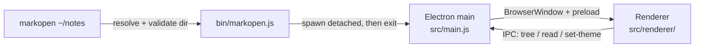

# Architecture

markopen is a small Electron app: no bundler, no framework, about 400 lines of our own code (JS, HTML, CSS).

## Launch flow



1. `bin/markopen.js` resolves the argument (default `.`) and exits with an error if it isn't a directory. It then runs `electron <appDir> <dir>` as a detached child and exits, so the terminal is free immediately.
2. `src/main.js` treats the last command-line argument as the root directory. It registers the IPC handlers and opens one window titled `markopen — <dir name>`. Closing the window quits the process.
3. The renderer asks main for the tree, draws the explorer, and asks for file contents when you click a file.

## Processes and the IPC surface

The page runs with `contextIsolation: true`, `sandbox: true` and `nodeIntegration: false`, so it has no Node or filesystem access of its own. `src/preload.js` exposes exactly three calls as `window.markopen`:

| Call | Main-process handler | Returns |
|---|---|---|
| `getTree()` | `buildTree(root)` | `{ rootName, tree }` |
| `readFile(rel)` | `fs.readFileSync(resolveInsideRoot(root, rel))` | file text |
| `setTheme('light' \| 'dark')` | `nativeTheme.themeSource = …` | nothing |

`resolveInsideRoot` (in `src/tree.js`) rejects any path that resolves outside the opened directory. That means even a compromised page can only read files under the root.

## File tree (`src/tree.js`)

`buildTree(root)` walks the directory synchronously and returns nested nodes `{ name, path, type: 'dir' | 'file', children? }`, with `path` relative to the root. Rules:

- keep `.md` / `.markdown` files (case-insensitive)
- skip dot-entries and `node_modules`
- drop folders that end up with no markdown in them
- sort folders before files, each group case-insensitively with numeric ordering
- silently skip folders that can't be read

The whole tree is built upfront. That's fast for normal directories (the Obsidian vault, 173 files, takes about 7ms), but it's a known limit for huge trees (see the roadmap).

## Rendering pipeline (`src/renderer/renderer.js`)

```
markdown text
  → markdown-it (html, linkify)            GFM tables, strikethrough, autolinks
      + highlight.js in the highlight hook  code fences with a known language
      + custom core rule "task-lists"       "- [ ]" / "- [x]" → disabled checkbox
      + fence override for ```mermaid       → <pre class="mermaid">
  → DOMPurify.sanitize                      strips scripts/handlers from raw HTML in notes
  → innerHTML into <article class="markdown-body">
  → mermaid.run() on pre.mermaid nodes      diagrams become SVG
```

The libraries are loaded as plain `<script>` tags straight from `node_modules` (their browser/UMD builds), which is why there's no build step. The page's Content-Security-Policy allows scripts only from the app itself, plus images from `https:` and `data:`.

## Styling and theme

- `github-markdown-css` styles the document; `styles.css` handles the two-pane layout and the sidebar.
- All colours, including the highlight.js theme (two `<link>`s with `media="(prefers-color-scheme: …)"`), switch on `prefers-color-scheme`.
- **Toggle:** the button calls `setTheme`, main sets `nativeTheme.themeSource`, and Chromium then flips `prefers-color-scheme` for the page, so every stylesheet follows with no extra CSS. The renderer listens for that media-query change to swap the button icon, re-initialise Mermaid with the matching theme, and re-render the open file, keeping its scroll position.
- The choice is saved in `localStorage` under `theme` and applied at startup, before the first render. Until you click the toggle, nothing is saved and the app follows macOS.
- **Sidebar collapse:** the ‹/› button toggles a `collapsed` class on `#sidebar`. That shrinks the sidebar to a 36px strip and hides everything in it except the button. The state is saved in `localStorage` under `sidebarCollapsed` and restored at startup.
- The document column is capped at 1920px (`#doc` `max-width`) and centred, so it uses most of a wide window.

## Link handling

The window must never navigate away from the viewer. `will-navigate` is always cancelled, and `setWindowOpenHandler` always denies. In both cases `http(s)` URLs are passed to `shell.openExternal`, which opens them in your default browser. Everything else, including relative `.md` links, currently does nothing.

## Testing

- `npm test` runs `test/tree.test.js` (node:test) against a temporary directory fixture. It covers filtering, pruning, sorting, nesting and path-escape rejection.
- The UI was checked by running a throwaway Electron script. It loads `src/main.js`, inspects the DOM via `executeJavaScript` and saves `webContents.capturePage()` screenshots, because macOS `screencapture` isn't permitted from the terminal here. That script isn't kept in the repo.
